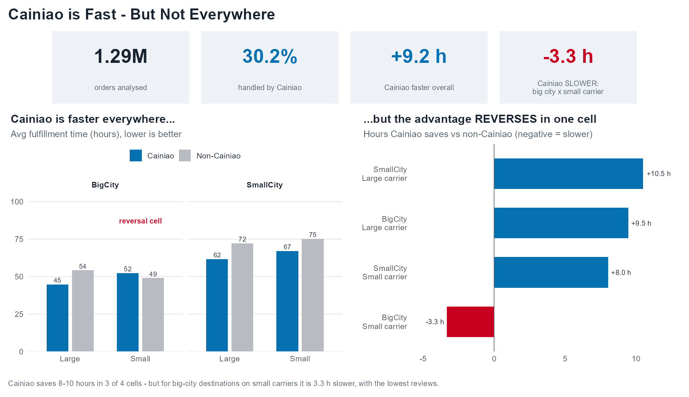
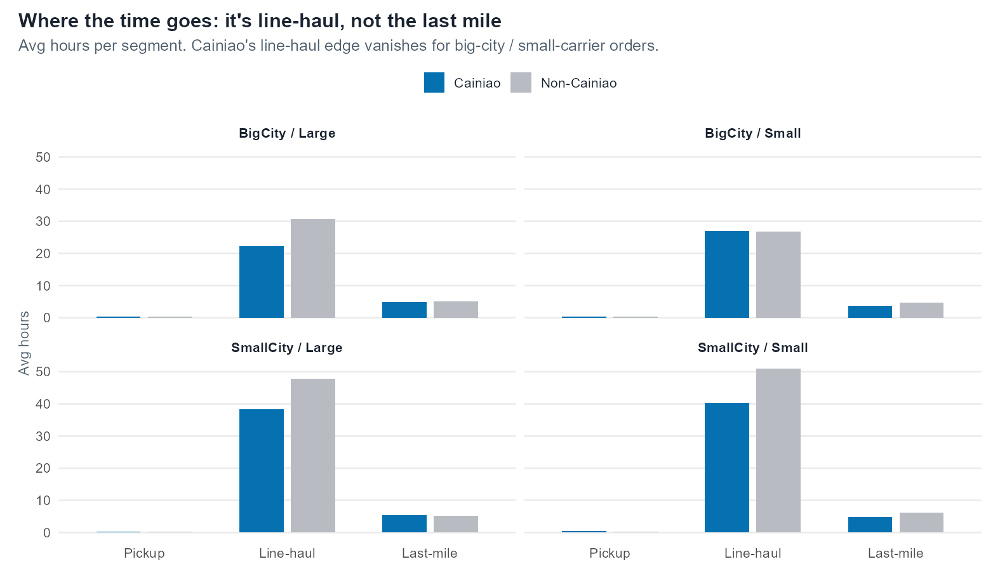

# 菜鸟快，但不是处处都快 | Cainiao is Fast — But Not Everywhere

<p align="center">
  <a href="#中文"></a>
  &nbsp;
  <a href="#english"></a>
</p>

<p align="center">
  
  
  
  
  
  
  
</p>

---

## 中文

### 一句话概览

本项目是 BUAD 345（决策分析与可视化）期末课程项目，用 **R** 做分析、**Tableau** 做可视化，研究阿里巴巴**菜鸟**物流网络是否真的让订单履约更快。受众设定为**菜鸟平台**，遵循"数据驱动 + 层级深挖 + 故事讲述"的课程要求。

**主结论不是"菜鸟全面更快"，而是：** 菜鸟整体比非菜鸟快约 **9.2 小时**，但在「**大城市目的地 + 小物流公司**」这一格反而**慢 3.3 小时**，该格客户评分也最低，瓶颈出在**设施间干线运输（line-haul）**，而非最后一公里。

### 两句话总结

1. 菜鸟整体显著缩短订单履约时间（约 9 小时，且通过承诺时效对照检验稳健）。
2. 但这一优势在「大城市 + 小承运商」组合下基本消失甚至反转，根因在干线运输而非最后一公里。

### 快速导航

| 你想看什么 | 入口 |
|---|---|
| 核心结论数字 | [关键结果](#关键结果) |
| 分析方法（层级设计） | [方法](#方法) |
| 仓库结构 | [仓库结构](#仓库结构) |
| 如何复现 | [快速开始](#快速开始) |
| 交付物 | [交付物](#交付物) |
| 数据合规说明 | [数据说明](#数据说明) |

### 关键结果

评价区间 `2017-01-01` 至 `2017-07-31`，单位小时，定义 `totaltime = SIGNED − pay_timestamp`。

| 目的地城市 | 物流公司 | 菜鸟 (h) | 非菜鸟 (h) | **菜鸟省下 (h)** | 样本量 |
|---|---|--:|--:|--:|--:|
| 大城市 | 大公司 | 44.7 | 54.2 | **+9.5** | 96,301 |
| 大城市 | **小公司** | **52.4** | **49.1** | **−3.3** | 22,756 |
| 小城市 | 大公司 | 61.7 | 72.2 | **+10.5** | 857,583 |
| 小城市 | 小公司 | 67.1 | 75.2 | **+8.0** | 311,798 |

**punchline（转折点）净值对比**

<p align="center"></p>

**机制：时间分段（干线运输主导，非最后一公里）**

<p align="center"></p>

### 方法

层级式深挖（每层在上一层结论基础上加一个变量），而非彼此无关的并列对比：

| 层级 | 加入的变量 | 结论 |
|---|---|---|
| L1 | 菜鸟 vs 非菜鸟 | 菜鸟快约 9.2h；剔除承诺时效后仍成立 |
| L2 | + 物流公司规模（>20万单为大） | 大公司省 10h，小公司省 7h |
| L3 | + 目的地城市规模（前 2 大签收城市为大城市） | **大城市 × 小公司：菜鸟反而慢 3.3h** |
| 机制 | 揽收 / 干线 / 最后一公里分段 | 差距在干线运输，不在最后一公里 |

诚实的反例：小承运商经过的城市反而**更少**（不支持"多次中转"假设），故瓶颈是单段转运/停留时间。

### 仓库结构

```text
.
├── R/                     # 分析流水线（在仓库根目录运行）
│   ├── 01_build_analysis_table.R   # 三个 CSV → 订单级分析表（时间/分段/规模）
│   ├── 02_aggregate_and_export.R   # → tableau_data/*.csv + 打印关键数字
│   ├── 03_figures.R                # → figures/*.png
│   └── run_all.R                   # 顺序运行 01→04（含仪表盘）
├── tableau_data/          # 体积小、可入库的聚合 CSV（Tableau 数据源）
├── tableau/               # TABLEAU_BUILD_GUIDE.md：逐看板搭建指南
├── figures/               # R 生成的图
├── report/                # report.tex/md/pdf（~9 页）+ slides.tex/pdf（Beamer）+ 演示提纲
└── Cainiao_Project.r      # 原始起步脚本（保留）
```

### 快速开始

需要 R（`data.table`、`lubridate`、`ggplot2`）以及根目录下的三个原始 CSV（未随仓库分发，见[数据说明](#数据说明)）。

```bash
# 运行完整分析流水线
Rscript R/run_all.R

# 编译报告与答辩稿（需 LaTeX）
cd report && pdflatex report.tex && pdflatex report.tex
pdflatex slides.tex && pdflatex slides.tex
```

Tableau 看板按 `tableau/TABLEAU_BUILD_GUIDE.md` 基于 `tableau_data/` 搭建。

### 交付物

| 交付物 | 文件 |
|---|---|
| 书面报告（~9 页，含真实文献引用） | `report/report.pdf` |
| 答辩稿（LaTeX Beamer，14 帧） | `report/slides.pdf` |
| 演示提纲 | `report/presentation_outline.md` |
| Tableau 搭建指南 | `tableau/TABLEAU_BUILD_GUIDE.md` |
| 可视化数据源 | `tableau_data/*.csv` |

### 数据说明

原始三个 CSV 为非公开 M&SOM 数据集（"Do NOT share the data"），且物流文件达 969MB（超过 GitHub 100MB 上限），因此**已通过 `.gitignore` 排除、未推送**。仓库只包含派生的**聚合统计表**与去标识抽样，不含原始数据。

---

## English

### At A Glance

BUAD 345 (Decision Analytics and Visualization) final project. Analysis in **R**,
visualization in **Tableau**. We study whether Alibaba's **Cainiao** logistics
platform actually makes order fulfillment faster. Audience: **Cainiao**. The work
follows the course's data-driven, hierarchical, story-first rubric.

**The main result is not "Cainiao is faster everywhere."** Cainiao is about
**9.2 hours faster** overall, **but** for **big-city destinations handled by small
carriers it is 3.3 hours slower**, customer reviews there are the lowest in the
network, and the bottleneck is **between-facility line-haul**, not the last mile.

### Two-Sentence Summary

1. Cainiao significantly shortens fulfillment time across the marketplace (~9 h,
   robust to a promise-window control).
2. But that advantage largely disappears — and reverses — for big-city
   destinations served by small carriers, with the bottleneck in line-haul rather
   than the last mile.

### Navigation

| Looking for | Section |
|---|---|
| Headline numbers | [Key Results](#key-results) |
| Hierarchical method | [Method](#method-1) |
| Repository structure | [Repository Structure](#repository-structure) |
| Reproduction | [Quick Start](#quick-start) |
| Deliverables | [Deliverables](#deliverables) |
| Data note | [Data Note](#data-note) |

### Key Results

Period `2017-01-01`–`2017-07-31`; hours; `totaltime = SIGNED − pay_timestamp`.

| Destination | Carrier | Cainiao (h) | Non-Cainiao (h) | **Cainiao saved (h)** | n |
|---|---|--:|--:|--:|--:|
| Big city   | Large | 44.7 | 54.2 | **+9.5** | 96,301 |
| Big city   | **Small** | **52.4** | **49.1** | **−3.3** | 22,756 |
| Small city | Large | 61.7 | 72.2 | **+10.5** | 857,583 |
| Small city | Small | 67.1 | 75.2 | **+8.0** | 311,798 |

<p align="center"></p>

### Method

Hierarchical, not parallel — add one variable per level:

| Level | Added variable | Result |
|---|---|---|
| L1 | Cainiao vs non-Cainiao | ~9.2 h faster; holds after a no-promise control |
| L2 | + carrier size (Large = >200k orders) | Large saves 10 h, Small saves 7 h |
| L3 | + destination-city size (top-2 signing cities) | **Big city × Small carrier: Cainiao 3.3 h slower** |
| Mechanism | pre-delivery / line-haul / last-mile | Gap is line-haul, not last mile |

Honest non-result: small carriers pass through *fewer* cities (no "more stops"),
so the penalty is per-leg transit/dwell, not hop count.

### Repository Structure

```text
.
├── R/                     # analysis pipeline (run from repo root)
├── tableau_data/          # small, committed aggregate CSVs (Tableau sources)
├── tableau/               # TABLEAU_BUILD_GUIDE.md (step-by-step build guide)
├── figures/               # ggplot figures
├── report/                # report.tex/md/pdf (~9 pp) + slides.tex/pdf (Beamer) + outline
└── Cainiao_Project.r      # original starter script (kept)
```

### Quick Start

Requires R (`data.table`, `lubridate`, `ggplot2`) and the three raw CSVs in the
repo root (not distributed — see Data Note).

```bash
Rscript R/run_all.R

cd report && pdflatex report.tex && pdflatex report.tex
pdflatex slides.tex && pdflatex slides.tex
```

Build the Tableau story from `tableau_data/` using `tableau/TABLEAU_BUILD_GUIDE.md`.

### Deliverables

| Deliverable | File |
|---|---|
| Written report (~9 pp, real citations) | `report/report.pdf` |
| Defense slides (LaTeX Beamer, 14 frames) | `report/slides.pdf` |
| Presentation outline | `report/presentation_outline.md` |
| Tableau build guide | `tableau/TABLEAU_BUILD_GUIDE.md` |
| Visualization data sources | `tableau_data/*.csv` |

### Data Note

The three raw CSVs are a non-public M&SOM dataset ("Do NOT share the data") and the
logistics file is 969 MB (over GitHub's 100 MB limit), so they are **git-ignored
and not pushed**. Only derived **aggregate** tables and a de-identified sample are
committed.

---

## References

1. Fisher, M. L., Gallino, S., & Xu, J. J. (2019). The value of rapid delivery in omnichannel retailing. *Journal of Marketing Research*, 56(5), 732–748.
2. Rao, S., Griffis, S. E., & Goldsby, T. J. (2011). Failure to deliver? Linking online order fulfillment glitches with future purchase behavior. *Journal of Operations Management*, 29(7–8), 692–703.
3. Yu, Y., Wang, X., Zhong, R. Y., & Huang, G. Q. (2016). E-commerce logistics in supply chain management: Practice perspective. *Procedia CIRP*, 52, 179–185.
4. Koç, Ç., Bektaş, T., Jabali, O., & Laporte, G. (2016). Thirty years of heterogeneous vehicle routing. *European Journal of Operational Research*, 249(1), 1–21.
5. Deutsch, Y., & Golany, B. (2018). A parcel locker network as a solution to the logistics last mile problem. *International Journal of Production Research*, 56(1–2), 251–261.

---

## License / 许可证

Released under the **MIT License** — see [`LICENSE`](LICENSE).
本仓库以 **MIT 许可证** 开源，详见 [`LICENSE`](LICENSE)。

The license covers only the code, analysis scripts, figures, and documentation in
this repository. It does **not** cover the underlying Cainiao / Tmall course
dataset, which is a non-public M&SOM dataset and is intentionally excluded.
许可证仅覆盖本仓库的代码、分析脚本、图表与文档；**不**覆盖底层的菜鸟 / 天猫课程数据集
（非公开 M&SOM 数据，已刻意排除、未入库）。
